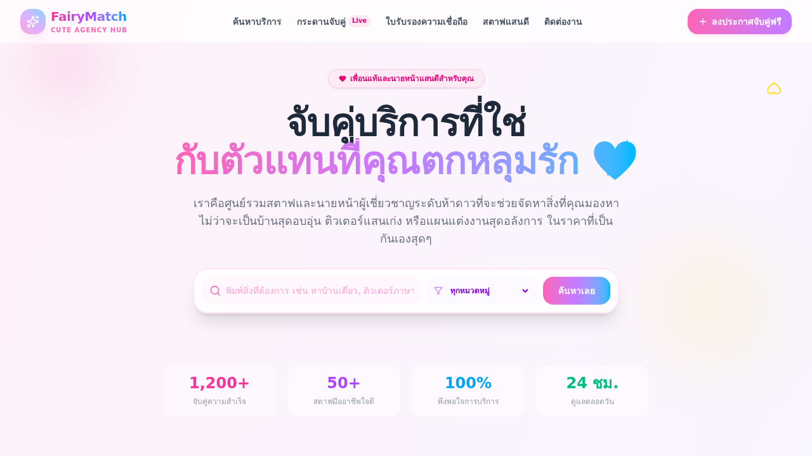

# X-Template V.0.0.0-Genesis

> Cyberpunk Glassmorphism starter template — React + TypeScript + Vite

[](https://github.com/Ex2-Axon/x-template/actions/workflows/deploy.yml)
[](https://bsky.app/profile/microtronic.bsky.social)

**Live demo:** https://ex2-axon.github.io/x-template/



---

## Stack

| | |
|---|---|
| **Framework** | React 19 + TypeScript |
| **Build tool** | Vite 8 |
| **Styling** | CSS (Glassmorphism + Neon) + Tailwind CSS 4 |
| **Package manager** | pnpm |
| **Deploy** | GitHub Pages (auto on push) |

---

## Features

- Cyberpunk glassmorphism UI with full animation
- Neon glow effects — cyan, pink, purple, green
- Animated grid background + floating particles
- Glitch text effect on title
- Scanline CRT overlay
- Orbit rings on hero image
- Staggered entrance animations
- Auto-deploy to GitHub Pages on push
- Auto-post to Discord, Bluesky, X on push

---

## Getting Started

```bash
# Install dependencies
pnpm install

# Start dev server
pnpm dev

# Build for production
pnpm build

# Preview production build
pnpm preview
```

---

## GitHub Actions Workflows

| Workflow | Trigger | Description |
|---|---|---|
| `deploy.yml` | push to main | Build & deploy to GitHub Pages |
| `discord-notify.yml` | push to main | Send release embed to Discord |
| `bluesky-notify.yml` | push to main | Post release to Bluesky |
| `x-notify.yml` | push to main | Post release to X (Twitter) |

### Required Secrets

Go to **Settings → Secrets and variables → Actions** and add:

| Secret | Description |
|---|---|
| `DISCORD_WEBHOOK_URL` | Discord webhook URL |
| `BSKY_IDENTIFIER` | Bluesky handle (e.g. `microtronic.bsky.social`) |
| `BSKY_APP_PASSWORD` | Bluesky app password |
| `X_API_KEY` | X Consumer Key |
| `X_API_SECRET` | X Consumer Secret |
| `X_ACCESS_TOKEN` | X Access Token |
| `X_ACCESS_TOKEN_SECRET` | X Access Token Secret |

---

## Project Structure

```
x-template/
├── .github/
│   └── workflows/
│       ├── deploy.yml
│       ├── discord-notify.yml
│       ├── bluesky-notify.yml
│       └── x-notify.yml
├── public/
│   ├── favicon.svg
│   └── icons.svg
├── src/
│   ├── assets/
│   ├── App.tsx
│   ├── App.css
│   ├── index.css
│   └── main.tsx
├── package.json
└── vite.config.ts
```

---

## Connect

- Bluesky: [@microtronic.bsky.social](https://bsky.app/profile/microtronic.bsky.social)
- Discord: [Join server](https://discord.gg/8Zeq8VCU)
- GitHub: [Ex2-Axon](https://github.com/Ex2-Axon)
